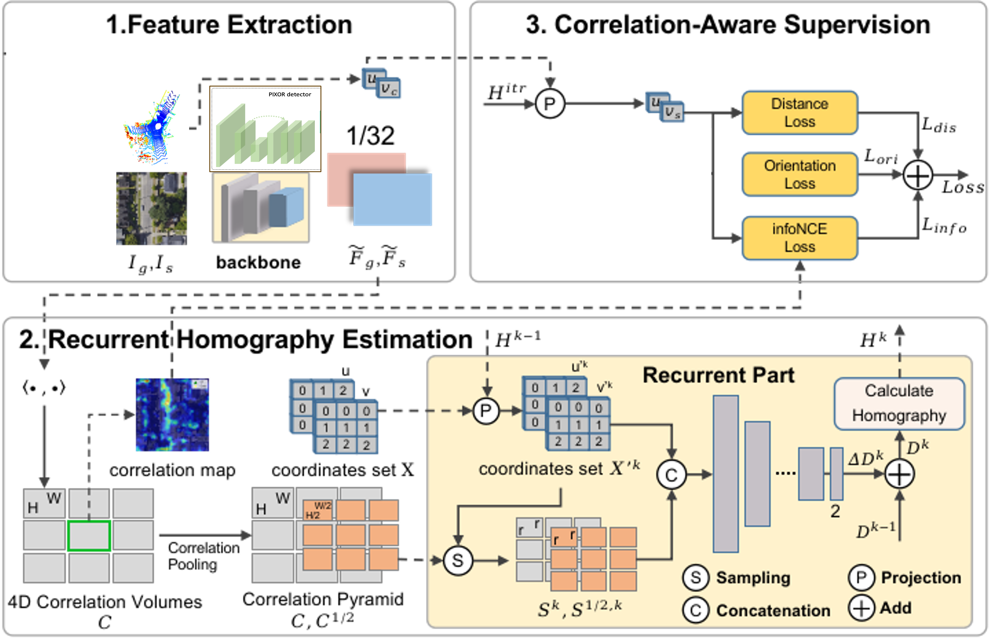

# Intro

This is a repository containing the result of a semester project on lidar and satellite image based cross-view metric localization. The project was conducted at EPFL in the VITA lab under the supervision of Dr. Z. Xia and Prof. A. Alahi. 

The model uses the Zensact Open Dataset (ZOD) and takes as input lidar points and a satellite image and outputs a 3 degree-of-freedom pose estimation (x,y,yaw). The model currently achieves a mean localization error of 12.41 m and an orientation error of 5.62 degrees. 




# File structure
- The model elements (model, losses, condiguration files, utils) are found in the model folder. 
- The dataloader for the ZOD is in the dataset folder.
- The current best trained model is in the checkpoint folder.
- The codes to run the model can be found in the sbatch folder. (The exact code lines are in the sbatch files if someone doesn't use sbatch...)

- To test the model sepatately on single batches, the jupyter notebook ```evaluate_model_single_sample.ipynb``` provides examples for plotting overlays of LiDAR over a satellite image or a heatmap.
- To make and overlay video, run the ```make_video.py``` code using the corresponding sbatch file.
- To see metrics of the currently training model, the ```training_visualization.ipynb``` jupyter notebook creates training plots and helps navigate validation logs

The ```requirements.txt``` should cover all the depenancies needed to run everything. 


